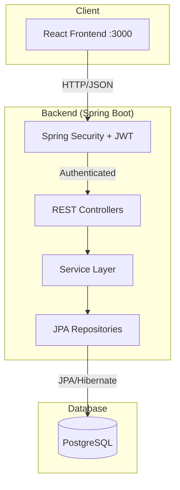
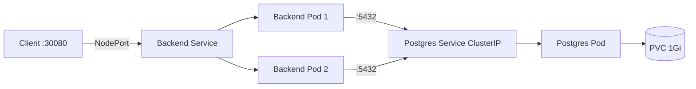

# UniEvent — Mimari Kararlar

## Genel Mimari

## Katmanlı Mimari (Layered Architecture)

| Katman | Sorumluluk | Spring Annotation |
|---|---|---|
| **Controller** | HTTP request/response, validation | `@RestController` |
| **Service** | İş mantığı, transaction yönetimi | `@Service`, `@Transactional` |
| **Repository** | Veritabanı erişimi | `@Repository`, `JpaRepository` |
| **Entity** | Veritabanı tablo eşlemesi | `@Entity` |
| **DTO/Record** | API kontratı, veri transferi | Java Record |
| **Security** | Kimlik doğrulama, yetkilendirme | `@Configuration` |
| **Exception** | Merkezi hata yönetimi | `@RestControllerAdvice` |

## Kritik Mimari Kararlar

### 1. Stateless Authentication (JWT)
- **Problem:** K8s'te birden fazla pod çalışıyor. Session sunucu tarafında tutulursa, pod-1'de oluşturulan session pod-2'de geçersiz olur.
- **Çözüm:** JWT token kullanımı. Token client tarafında saklanır, her istekte gönderilir. Herhangi bir pod isteği işleyebilir.
- **Fayda:** Horizontal scaling kolaylaşır, sticky session gerekmez.

### 2. DTO Pattern (Record)
- **Problem:** Entity'leri direkt response olarak dönmek passwordHash gibi hassas alanları sızdırır. Ayrıca lazy-loaded collection'lar serialize sırasında hata verir.
- **Çözüm:** Java Record ile immutable DTO'lar. Entity → DTO dönüşümü Service katmanında yapılır.
- **Fayda:** API kontratı ile DB yapısı birbirinden bağımsız kalır.

### 3. Pagination (@Pageable)
- **Problem:** Binlerce gönderiyi tek seferde çekmek belleği tüketir, ağ trafiğini şişirir.
- **Çözüm:** Spring Data JPA'nın `Pageable` desteği ile `LIMIT/OFFSET` sorguları.
- **Fayda:** Frontend infinite scroll veya sayfa navigasyonu yapabilir.

### 4. Global Exception Handler
- **Problem:** Her controller'da ayrı try-catch yazmak DRY prensibini ihlal eder ve tutarsız hata formatlarına yol açar.
- **Çözüm:** `@RestControllerAdvice` ile merkezi exception handling. Tüm hatalar aynı JSON yapısında döner.
- **Fayda:** Frontend tek bir hata formatını parse eder.

### 5. Environment-Based Configuration
- **Problem:** DB host, JWT secret gibi değerler ortama göre değişir (local, staging, prod).
- **Çözüm:** `application.yml`'de `${DB_HOST:localhost}` şeklinde env variable'lar. K8s'te ConfigMap/Secret ile inject edilir.
- **Fayda:** 12-Factor App uyumlu, image rebuild etmeden ayar değiştirilir.

## Kubernetes Deployment Mimarisi

| K8s Kaynağı | Açıklama |
|---|---|
| **Namespace** | `unievent` — kaynak izolasyonu |
| **ConfigMap** | DB host/port/name (hassas olmayan) |
| **Secret** | DB credentials + JWT secret (base64) |
| **PVC** | PostgreSQL veri kalıcılığı (1Gi) |
| **Deployment (DB)** | 1 replica, PVC mount |
| **Deployment (App)** | 2 replica, rolling update, liveness/readiness probes |
| **Service (DB)** | ClusterIP — sadece cluster içinden erişim |
| **Service (App)** | NodePort :30080 — dış dünyadan erişim |
