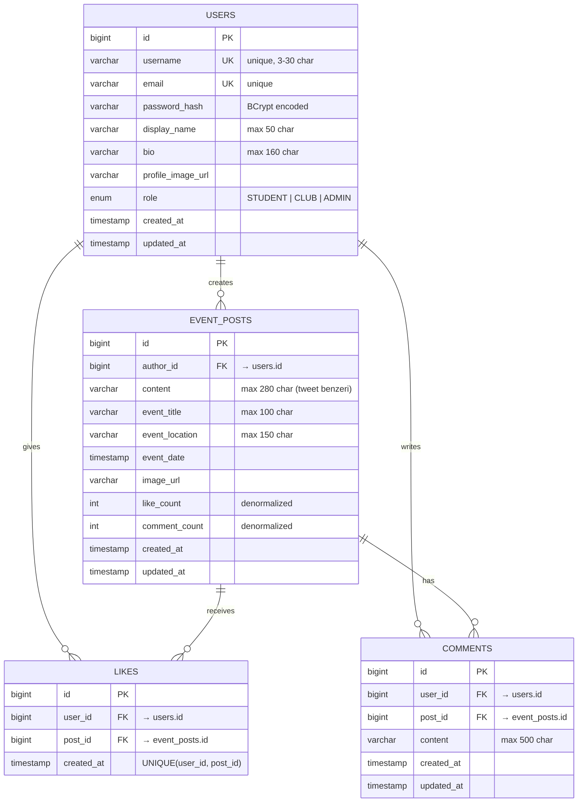

# UniEvent — Veritabanı ER Diyagramı

## İlişkisel Yapı

## Tasarım Kararları

| Karar | Neden |
|---|---|
| `like_count` / `comment_count` denormalized | Feed sorgusunda her post için COUNT subquery yerine O(1) okuma |
| `UNIQUE(user_id, post_id)` on LIKES | Bir kullanıcının aynı postu birden fazla beğenmesini DB seviyesinde engeller |
| `role` enum string (`@Enumerated(STRING)`) | Ordinal (0,1,2) sıra bağımlılığı yaratır — string daha güvenli |
| `@PrePersist` / `@PreUpdate` | Timestamp'ler uygulama seviyesinde otomatik yönetilir |
| `FetchType.LAZY` tüm ilişkilerde | İlişkili entity'ler sadece erişildiğinde yüklenir — performans |
